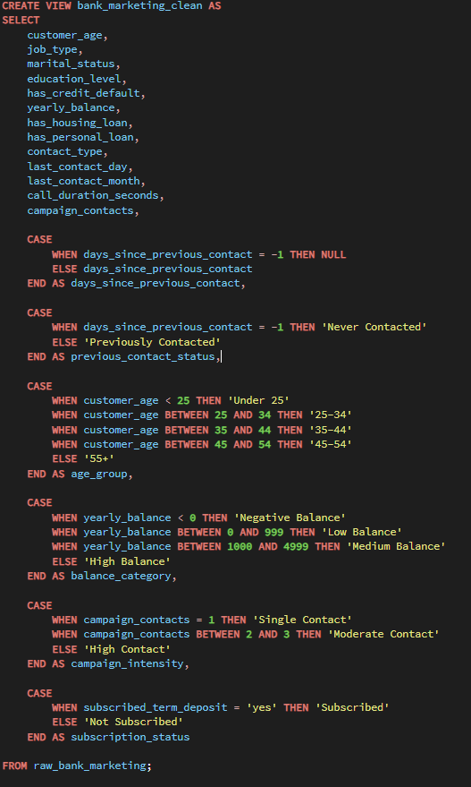
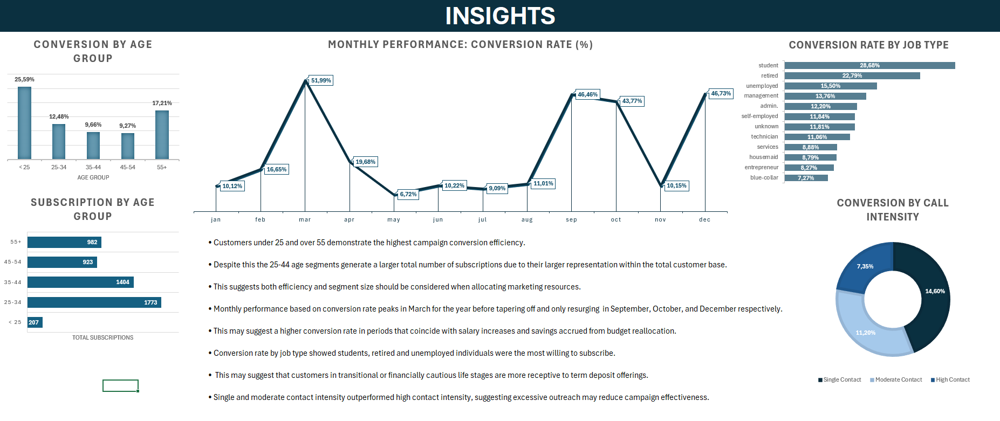
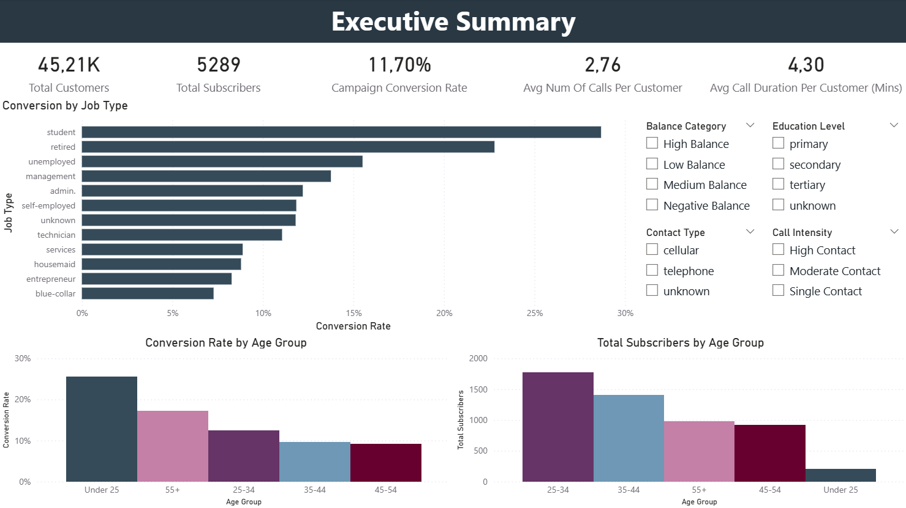
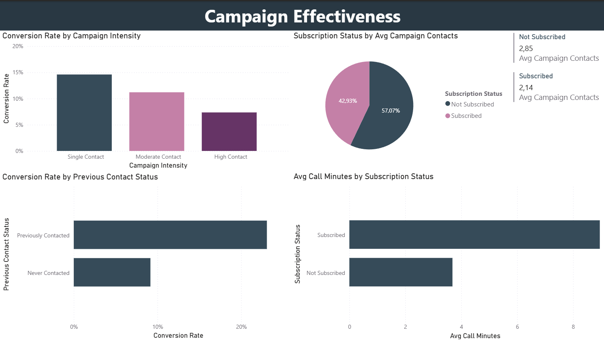
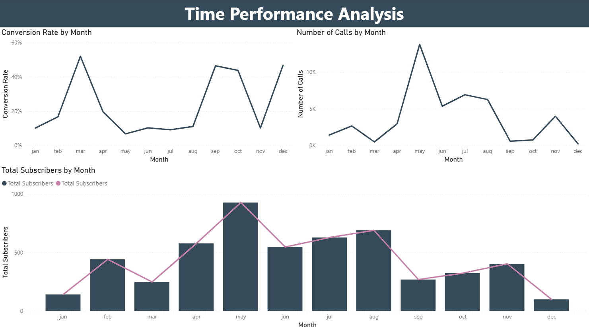
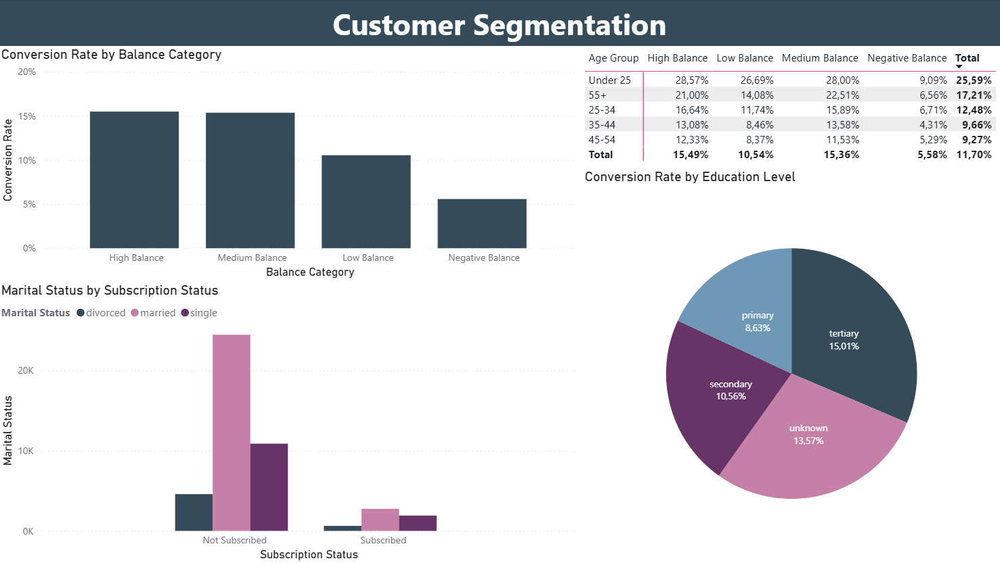

# Marketing-Campaign-Performance-Analysis

## Overview

This project analyzes the performance of a direct marketing campaign to evaluate customer conversion patterns, campaign effectiveness, and demographic trends using SQL, Excel, Power BI, and business reporting techniques.

The objective was to identify:

- Customer segments most likely to subscribe
- Campaign effectiveness across different customer groups
- Seasonal conversion trends
- Customer behavioral patterns
- Opportunities to improve future marketing performance

The project follows a complete analytics workflow from SQL data preparation through dashboard development and executive reporting.

## Tools & Technologies

- PostgreSQL
- Command Prompt
- SQL
- Microsoft Excel
- Power BI
- Power Query
- PDF Reporting

PLEASE NOTE:

The project begins by creating a SQL view that engineers analytical features—including customer age groups, balance categories, campaign intensity, and previous contact status—to simplify downstream analysis and dashboard development.

---

## Project Workflow

### 1. SQL Data Preparation & Feature Engineering

The original bank marketing dataset was transformed into an analytics-ready SQL view using Common Table Expressions (CTEs) and CASE statements.

The SQL workflow created business-friendly analytical fields including:

- Age Group
- Balance Category
- Campaign Intensity
- Previous Contact Status
- Subscription Status

Invalid previous contact values (-1) were replaced with NULL values and categorized as "Never Contacted" to improve analytical accuracy.

### SQL View Used

### Outcome

- Created a clean analytical dataset for reporting
- Engineered customer segmentation variables
- Standardized campaign classifications
- Prepared dataset for Excel analysis and Power BI dashboarding

---

### 2. Excel Data Preparation & Exploratory Analysis

After exporting the SQL view into CSV format, the dataset was imported into Excel for exploratory analysis and dashboard preparation.

#### Workbook Structure

- Raw Data
- Working Sheet
- KPI Values
- Pivot Tables
- Quick Insights

#### Data Preparation Tasks

- Verified row counts and data integrity
- Confirmed column names and data types
- Checked for missing values and anomalies
- Preserved the original dataset using a separate working sheet
- Prepared data for Pivot Table analysis

---

### 3. Exploratory Data Analysis (Excel)

### Pivot Tables Created

#### Conversion by Age Group

- Customer Count
- Subscribers
- Conversion Rate

#### Conversion by Job Type

- Customer Count
- Subscribers
- Conversion Rate

#### Conversion by Education Level

- Customer Count
- Subscribers
- Conversion Rate

#### Conversion by Balance Category

- Customer Count
- Subscribers
- Conversion Rate

#### Campaign Intensity Analysis

- Customer Count
- Subscribers
- Conversion Rate

#### Previous Contact Status

- Customer Count
- Subscribers
- Conversion Rate

#### Monthly Campaign Performance

- Customer Count
- Subscribers
- Conversion Rate

---

### Business Questions Investigated

- Which customer segments achieve the highest conversion rates?
- Does campaign frequency improve subscription success?
- How does previous customer contact affect campaign performance?
- Are there seasonal trends in campaign performance?
- Which customer characteristics should future campaigns target?

---

### Key Insights Identified

- Customers under 25 and over 55 achieved the highest conversion rates.
- Customers aged 25–44 generated the largest number of subscriptions due to their larger representation within the customer base.
- Customers contacted only once achieved the highest conversion rate (14.60%).
- High-contact campaigns produced the lowest conversion rate (7.35%), indicating diminishing returns from excessive outreach.
- Previously contacted customers converted at more than twice the rate of new prospects (23.07% vs. 9.16%).
- Subscribers required fewer campaign contacts on average while recording longer average call durations.
- Campaign conversion peaked during March before strengthening again throughout Q4.
- Students, retirees, unemployed customers, and customers with medium to high account balances achieved the strongest conversion performance.

---

### 4. Power BI Dashboard Development

The cleaned dataset was imported into Power BI for interactive dashboard creation.

#### Power Query Transformations

- Verified imported data types
- Standardized data formatting
- Validated imported records
- Prepared the dataset for reporting

---

### Dashboard Features

#### KPI Cards

- Total Customers
- Total Subscribers
- Campaign Conversion Rate
- Average Campaign Contacts
- Average Call Duration

#### Dashboard Pages

##### Executive Summary

High-level KPIs summarizing campaign performance.

##### Campaign Effectiveness

Visualizations comparing:

- Campaign Intensity
- Previous Contact Status
- Campaign Contacts
- Call Duration

##### Time Performance

Monthly trends showing:

- Total Campaign Calls
- Total Subscribers
- Campaign Conversion Rate

##### Customer Segment Dashboard

Campaign performance across:

- Age Groups
- Job Types
- Education Levels
- Balance Categories
- Marital Status

---

## 5. PDF Business Report

A structured business report was created summarizing:

- Customer demographic performance
- Campaign effectiveness
- Seasonal trends
- Customer segmentation
- Strategic recommendations

### Key Recommendations

#### Prioritize High-Converting Customer Segments

- Increase marketing investment toward younger customers, older customers, students, retirees, and customers with higher account balances.
- Continue targeting larger age groups while improving campaign efficiency through personalized messaging.

#### Optimize Campaign Contact Strategy

- Reduce unnecessary repeat contacts.
- Focus on improving customer interaction quality.
- Prioritize follow-up campaigns for previously engaged customers.

#### Align Campaign Timing with Seasonal Performance

- Increase campaign activity ahead of historically stronger conversion periods such as March and Q4.
- Investigate May's high campaign volume but comparatively low conversion efficiency.

#### Improve Customer Segmentation

- Develop more targeted marketing campaigns using occupation, education, balance category, and previous campaign history.
- Improve campaign efficiency while reducing unnecessary marketing expenditure.

---

## Key Findings

- Highest Converting Age Groups : Under 25 & 55+
- Highest Conversion Rate (Campaign Intensity) : Single Contact (14.60%)
- Previous Contact Conversion Rate : 23.07%
- Never Contacted Conversion Rate : 9.16%
- Lowest Performing Campaign Strategy : High Contact Campaigns
- Strongest Seasonal Performance : March & Q4
- Highest Converting Occupations : Students, Retired & Unemployed
- Highest Converting Balance Groups : Medium & High Balance Customers

---

## Skills Demonstrated

- SQL Querying
- PostgreSQL
- SQL Views
- Common Table Expressions (CTEs)
- CASE Statements
- Data Cleaning & Preparation
- Feature Engineering
- Excel Pivot Tables & Analysis
- Exploratory Data Analysis (EDA)
- Power BI Dashboard Development
- Power Query Transformations
- Marketing Analytics
- Campaign Performance Analysis
- Customer Segmentation
- Business Reporting
- Data Storytelling

---

## Final Conclusion

This project demonstrates an end-to-end marketing analytics workflow combining SQL, Excel, Power BI, and business reporting.

The analysis identified high-performing customer segments, demonstrated the value of previous customer relationships, revealed diminishing returns from excessive campaign contact, and highlighted seasonal opportunities to improve marketing effectiveness.

The project also demonstrates practical skills in:

- SQL feature engineering
- Customer segmentation
- Marketing performance analysis
- Dashboard development
- Business insight generation
- Executive-level reporting
